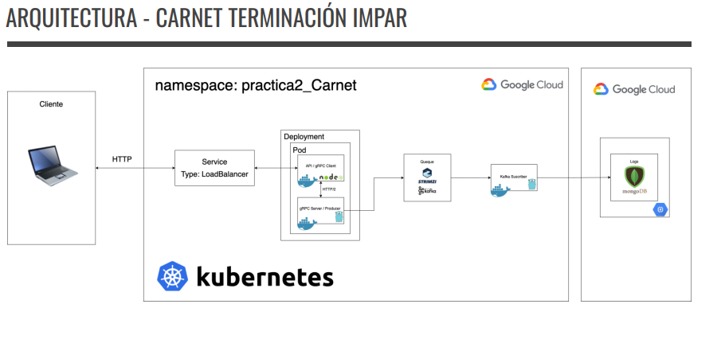
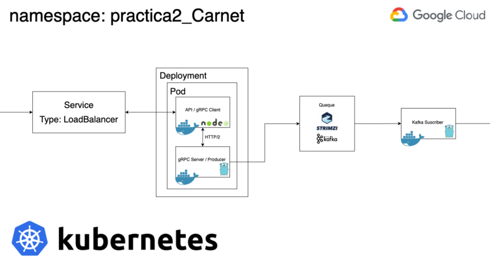
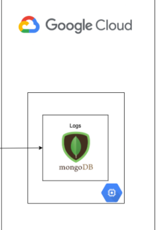
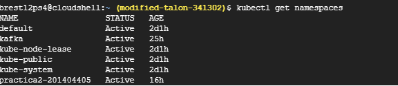
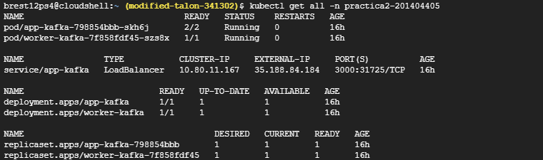

# Arquitectura Implementada

<p align="center"> 
  
</p>

La aplicacion se construyo con una arquitectura basada en la nube (GCP), Haciendo uso de distintos servicios; Principalmente Kubernetes, para poder desplegar un cluster que es el que contiene los servicios fundamentales de esta practica. El cluster tiene un deployment de tipo loadbalancer que contiene un pod con el cliente y servidor de gRPC, Este deployment se comunican con Kafka para posteriormente enviar los datos a almacenar a la base de datos.

# Kubernetes 
## Kubernetes Deployment
<p align="center"> 
  
</p>
El cliente y servidor de gRPC, fueron desplegados en un Pod de Kubernetes, asimismo se hizo un deployment de tipo LoadBalancer con este Pod.
<br>
Este se comunica con Kafka (strimzi) que trabaja en conjunto con un subscriber realizado en Go para enviar logs a la base de datos.

El archivo .yaml para levantar el deployment en Kubernetes con el namespace practica2-201404405, se encuentra en el archivo 
> [services-practica.yaml](#services-practica-yaml)

<br>
Y Para levantar Kafka con Strimzi para gestionar las colas basta con correr los siguientes comandos:

> kubectl create namespace kafka 
> 
> kubectl create -f 'https://strimzi.io/install/latest?namespace=kafka' -n kafka
> 
> kubectl apply -f https://strimzi.io/examples/latest/kafka/kafka-persistent-single.yaml -n kafka 
> 
> kubectl wait kafka/my-cluster --for=condition=Ready --timeout=300s -n kafka 

</br>


# Base de Datos - MongoDB
<p align="center"> 
  
</p>
En una maquina virtual de GCP se instalo Docker y se levanto un contenedor de MongoDB la cual es la encargada de guardar los diferentes logs enviados por el subscriber de Kafka.
</br>
<hr>

# Kubernetes Extra

Existen comandos que pueden ayudar a verificar que todo se levanto correctamente como por ejemplo 

```
kubectl get namespaces
```
Este comando muestra los namespaces existentes en nuestro cluster. Como referencia, los que creados para este proyecto son los llamados 'kafka' y 'practica2-201404405'
<p align="center"> 
  
</p>
<hr>

```
kubectl get all
```
Con este comando podemos ver todos los pods, deployments, servicios, replicas creados en el namespace por defecto. En el caso de la aplicacion si se requiere ver la informacion relevante se debe agregar la flag "-n nombrenamespace" 
```
kubectl get all-n practica2-201404405
```
<p align="center"> 
  
</p>
<hr>

```
kubectl logs 
```
Por ultimo si se quiere ver logs de los contenedores creados en el cluster, se puede utilizar este comando seguido del tipo y su namespace, en el caso de esta aplicacion podria ser:

```
kubectl logs pod/worker-kafka-7f858fdf45-szs8x -n practica2-201404405
```
Para obtener los logs del contenedor del subscriber de Kafka desarrollado en Go.
<p align="center"> 
  
</p>
<hr>