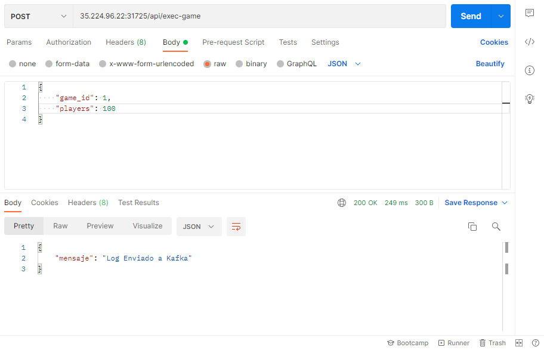
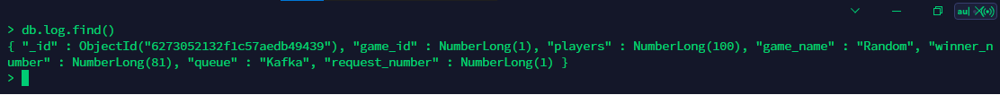

# **MANUAL DE USUARIO**

Se describe el funcionamiento y utilizacion correcto de la aplicacion

## ***Prerequisitos***
- Software para realizar peticiones de tipo POST, como Postman, insomnia REST, etc.

Para poder probar el funcionamiento de la aplicacion desplegada en kubernetes, basta con dirigirse a su software de preferencia para realizar una peticion de tipo POST. En este caso se usara POSTMAN.
<br>
El endpoint disponible para los juegos es el siguiente:
```
35.224.96.22:31725/api/exec-game
```
Y el body a enviar sigue la estructura JSON siguiente
```
{
    "game_id": 1,
    "players": 100
}
```
Tomando en cuenta que se puede enviar un numero del 1 al 5 para el campo "game_id" y un numero cualquiera para el campo "players"

<p align="center"> 
  
</p>
Al hacer la peticion se mostrar la respuesta "Log enviado a Kafka" que indica que se hizo correctamente.
<hr>
Finalmente, en la base de datos se muestra el log resultante de la peticion hecha desde el cliente.
<p align="center"> 
  
</p>